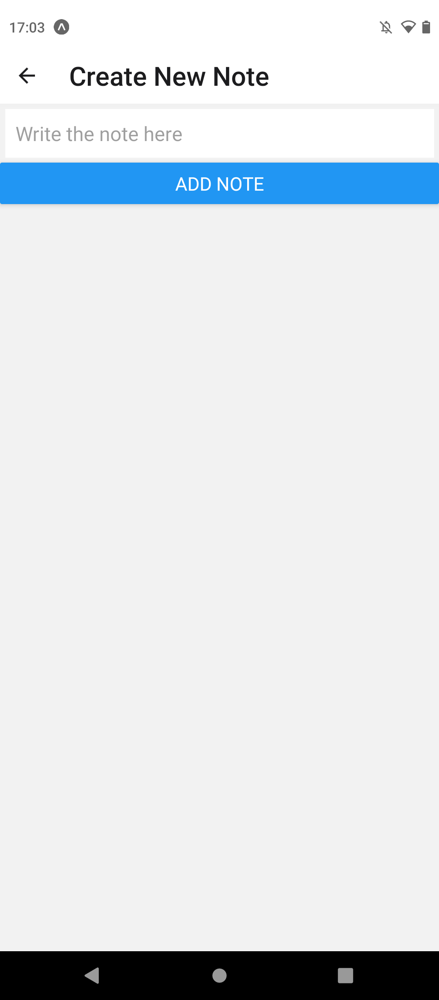

Mobile app **Notes** using React Native and Expo  
Tools: Expo cli in linus and Expo go in Android physical device


libraries needed  
```
$ npm install @react-navigation/native
$ expo install react-native-gesture-handler react-native-reanimated react-native-screens react-native-safe-area-context @react-native-community/masked-view
$ npm install @react-navigation/stack
$ expo install @react-native-async-storage/async-storage
```


```
expo init nameofapp
cd nameofapp
npm start 
```

**Features**  
Main view:    
   - ScrollView to show retrieved notes
   - Button to open new view (Create New Note View)
   
Create New Note view:  
  - Text input field to write a new note
  - Button to save current note and return to main view
  
<br />
<br />

**Demo view**  
      


